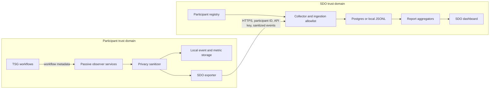

# Semantic Observability Architecture and Requirements

Status: Authoritative

Last verified: 2026-08-11

Source assignment: `F:\Project\Semantic observability in data spaces.pdf`

Repositories in scope:

- `sdo-semantic-observability`: central SDO collector, aggregation API, registry, storage, and dashboard.
- `tno-security-gateway`: participant-side Control Plane and HTTP Data Plane observers, local sanitization, aggregation, and export.

This document is the authoritative definition of the platform's implemented behavior, known gaps, target privacy controls, and acceptance criteria. If another semantic-observability document conflicts with this one, this document takes precedence. Historical documents may explain prior implementation decisions but do not redefine the current status.

## 1. Scope and status rules

The assignment's software and architecture requirements are on page 1 of the source PDF. Page 2 describes the student profile, offer, and application process; it contains no platform requirements and is outside this system specification.

The status values in this document mean:

- **Implemented**: present in production code or the deployed proof of concept, with direct evidence and at least one relevant automated or executable check.
- **Partial**: some behavior exists, but an explicit part of the source requirement or a necessary privacy/production control is not complete.
- **Missing**: no adequate implementation or design evidence exists yet.

Status is evidence-based. Planned behavior must not be marked implemented until its code and acceptance check exist.

## 2. Source requirement traceability

| ID | Requirement | Status | Observer source | Event/metric | API/dashboard | Privacy control | Evidence |
|---|---|---|---|---|---|---|---|
| R1 | Give SDOs empirical evidence of how semantic standards are used in data exchanges. | **Partial** | TSG catalogue, dataset configuration, validation, policy, negotiation, transfer, and data-plane observers. | Adoption, friction, evolution, and stability events and metrics. | `GET /api/report`, `/api/artefacts`, `/api/events`; dashboard summary and visualizations. | Participant and operational identifiers are pseudonymized before export. | E02, E03, E05-E07. Runtime collection exists, but the hosted demonstration is controlled and partly synthetic rather than a documented real multi-organization evaluation. |
| R2 | Translate SDO information needs into a dashboard. | **Partial** | Central aggregators consume participant telemetry. | Coverage, completeness, validation, version, deprecated-use, transaction, and field-usage metrics. | Browser dashboard served by the collector. | Aggregated presentation; field results have participant thresholds. | E06-E08. The dashboard exists, but a formal stakeholder information-needs study and governance workflow have not been completed. |
| R3 | Capture structural metadata from exchanges without accessing sensitive payloads. | **Partial** | TSG observers receive workflow metadata; dataset configuration observer receives configured structural properties. | Sanitized semantic events and aggregate field-presence summaries. | `POST /api/ingest/events`; `/api/events`, `/api/report`, `/api/field-usage`. | Local sanitization, central allowlists, bounded scalar validation, and no raw-payload field in the accepted event model. | E02-E05, E09. Structural telemetry works, but field presence currently comes from configured `extraProps`, not from a validator-produced structural field set for every real exchange. |
| R4 | Strictly preserve the privacy of exchanged data content. | **Partial** | Participant-side privacy sanitizer and central ingestion normalizer. | Pseudonymous context, redacted error text, public governed IDs, and aggregate counts. | Ingestion rejects non-pseudonymized artefact references and drops undeclared fields. | Raw payloads and values are prohibited; small field summaries are suppressed. | E04, E05, E09. Gaps remain: deterministic unkeyed pseudonymization, unauthenticated read/registration routes, exposed participant contact metadata, and no enforced retention/deletion lifecycle. |
| R5 | Identify governed fields that were not observed in a defined evidence window. | **Partial** | HTTP Data Plane dataset configuration observer and local field-usage buckets. | `semantic-field.usage.summary` with governed standard, version, canonical field ID, observation count, and present count. | `GET /api/field-usage`; Governed Semantic Field Usage dashboard card. | Local minimum observations, central minimum participants, counts only, and no values. | E06-E10. Aggregation and display are implemented; automatic observations are limited to configured metadata properties, and the demo summaries are synthetic. |
| R6 | Associate governed standard versions with validation failures. | **Implemented** | HTTP Data Plane metadata validation observer. | `metadata.validation.result` with public governed standard ID, governed version, status, and failure category. | `GET /api/version-validation`; Validation Errors by Governed Version dashboard card. | Dataset identity is pseudonymized; error text is redacted; no payload is exported. | E03, E06-E09. The dashboard explicitly reports association, not causation. |
| R7 | Design an Observer integration architecture for decentralized Data Spaces and their connectors/protocols. | **Partial** | Passive services integrated into TSG Control Plane and HTTP Data Plane workflows. | Catalogue, dataset configuration, metadata validation, policy evaluation, negotiation state, transfer state, and data-plane access events. | Participant management APIs plus central ingestion and reports. | Observation is derived locally before outbound HTTPS export. | E02, E03. TSG integration is implemented, but the architecture is not yet demonstrated as a connector-independent pattern. |
| R8 | Analyze IDS and DSSC architectures to identify Observer integration points. | **Missing** | None beyond the current TSG Dataspace Protocol integration. | None. | None. | Not applicable until the analysis exists. | No comparative IDS/DSSC architecture analysis or reusable integration-point catalogue exists. |
| R9 | Define metrics that indicate standard adoption. | **Implemented** | Catalogue and dataset configuration observers. | Semantic-model coverage, schema-reference coverage, metadata completeness, artefact-version adoption, deprecated-artefact usage, and governed-field presence. | `GET /api/report`, `/api/artefacts`, `/api/field-usage`; adoption dashboard cards. | Artefact references are pseudonymized; governed IDs are allowed only when intentionally public. | E02, E03, E06-E09. |
| R10 | Define metrics that indicate semantic and operational friction. | **Implemented** | Validation, policy, negotiation, transfer, and data-plane access observers. | Validation error rate and categories, policy failures, negotiation/transfer/access success and failure rates, and transfer setup latency. | `GET /api/report`, `/api/version-validation`, `/api/transactions`; friction dashboard views. | Failure categories replace sensitive error messages; operational IDs are pseudonymized. | E02-E09. |
| R11 | Aggregate telemetry from multiple participants. | **Implemented** | Participant exporters and central collector. | Participant-attributed sanitized events, full-history observed participant count, version aggregation, and thresholded field aggregation. | Participant registration and ingestion APIs; filtered reports, transactions, version validation, and field usage. | Per-participant API key for ingestion; central field results require at least two participants by default. | E05, E06, E08, E11. Read-side access control remains an R4/R13 gap. |
| R12 | Use telemetry to support evidence-based semantic-governance decisions. | **Partial** | Central report builders. | Time-filtered adoption and friction evidence. | Dashboard filters, trends, artefact detail, version association, and field-presence evidence. | Claims are bounded by observed time window, observation count, and participant count. | E06-E08. Evidence is visible, but decision records, review/approval, standards feedback, and a real governance evaluation are missing. |
| R13 | Deliver a privacy-preserving architectural design. | **Partial** | This document consolidates the implemented architecture and target controls. | Data contract, trust boundaries, privacy rules, lifecycle, and acceptance criteria below. | Current and required endpoint authorization are defined below. | Data minimization exists; RBAC, keyed pseudonymization, retention, and deletion remain target controls. | E01-E11 and sections 3-10. The design is documented, but the missing controls prevent an Implemented status. |
| R14 | Optionally demonstrate the architecture with a proof-of-concept technical artifact. | **Implemented** | TSG demo participants export to the central service. | Controlled scenarios for adoption, missing artefacts, deprecated artefacts, validation failure, version drift, and field usage. | Deployed Cloud Run dashboard and executable demo blueprint. | Demo rules prohibit payload inspection and secret disclosure. | E10, E12. Scenario telemetry is partly synthetic and must not be presented as real-world empirical evidence. |

## 3. System context and components



### 3.1 Participant-side components

| Component | Responsibility | Current implementation |
|---|---|---|
| TSG workflows | Execute catalogue, policy, negotiation, transfer, dataset configuration, validation, and data-plane operations. | Existing TSG Control Plane and HTTP Data Plane services. |
| Observer services | Passively derive semantic and operational observations from workflow metadata. Observer failures must not break the underlying exchange. | `catalog-observer.service.ts`, `policy-observer.service.ts`, `negotiation-observer.service.ts`, `transfer-observer.service.ts`, `transfer-execution-observer.service.ts`, and `dataset-config-observer.service.ts`. |
| Privacy sanitizer | Pseudonymize linkable identifiers, redact sensitive attributes, and reconstruct the allowed event shape. | `libs/semantic-observability/src/privacy.ts` and `sanitizer.ts`. |
| Local storage and aggregation | Persist sanitized events/snapshots and accumulate field-presence counts. | Plane-specific semantic observability services and TypeORM DAOs. Field buckets are currently in memory and reset on restart. |
| SDO exporter | Send a sanitized copy of local events to the central collector when explicitly enabled. | Plane-specific `semantic-observability-sdo-exporter.service.ts`; disabled by default. |

### 3.2 Central SDO components

| Component | Responsibility | Current implementation |
|---|---|---|
| Participant registry | Issue a random participant ID and one-time API key, store only the API-key hash, and track participant status. | `src/participants.js` and the `sdo_participant` table. |
| Collector API | Authenticate ingestion, validate limits and types, reconstruct events from allowlisted fields, and persist accepted data. | `src/server.js`. |
| Storage | Store participant records and sanitized events. | Postgres in production; JSONL for local development. |
| Aggregation | Apply filters and calculate reports, artefact usage, transactions, version validation, field usage, and observed participant count. | `src/semantic.js`. |
| Dashboard | Present time-filtered evidence and state claim limitations. | `public/index.html`, `public/app.js`, and `public/styles.css`. |

## 4. Observer integration points

| Plane | Integration point | Event type | Primary dimension | Semantic-governance use |
|---|---|---|---|---|
| Control Plane | Dataset catalogue create/update/delete | `catalog.metadata.observed`, `dataset.metadata.changed` | Adoption | Coverage, completeness, artefact and version adoption. |
| Control Plane | Policy evaluation | `policy.evaluation.result` | Friction | Policy allow/deny and failure patterns. |
| Control Plane | Contract negotiation transitions | `negotiation.state.changed` | Stability, friction | Negotiation success/failure and participant-pair trends. |
| Control Plane | Transfer process transitions | `transfer.state.changed` | Stability, friction | Transfer success/failure and setup latency. |
| HTTP Data Plane | Dataset configuration and item observation | `dataset.configuration.observed` | Adoption | Configured artefacts, versions, completeness, and governed-field presence. |
| HTTP Data Plane | Metadata validation result | `metadata.validation.result` | Friction | Validation rate, failure categories, and version/error association. |
| HTTP Data Plane | Transfer execution | `transfer.state.changed` | Stability, friction | Data-plane transfer behavior. |
| HTTP Data Plane | Authorized or failed data access | `data-plane.access.observed` | Stability, friction | Access success/failure without response bodies. |

The current integration model is specific to TSG and the Dataspace Protocol implementation. R8 remains missing until equivalent IDS/DSSC components, interfaces, and trust boundaries are analyzed and mapped.

## 5. Trust boundaries and current gaps

| Boundary | Data crossing the boundary | Current control | Known gap / required control |
|---|---|---|---|
| Business processing -> observer | Workflow metadata, schema/configuration metadata, validation outcome. | Passive observer APIs; no raw payload field in the semantic event model. | Field-presence input must eventually come from a validator-produced set of canonical IDs, never payload values. |
| Observer -> local observability store | Sanitized event. | Mandatory sanitizer pseudonymizes IDs and redacts sensitive attributes. | Current pseudonyms use a deterministic unkeyed hash; replace with purpose-separated HMAC-SHA-256. |
| Participant -> central collector | Participant ID, API key headers, sanitized event batch. | Per-participant API key, bounded request size and batch size, event validation, context/attribute allowlists. | Enforce HTTPS in deployment, rate limits, key revocation, and registration authorization/invitation. |
| Collector -> central storage | Participant registry data and accepted events. | API keys stored as SHA-256 hashes; production Postgres encryption is provided by the platform. | Add retention, deletion, cascade behavior, least-privilege DB credentials, and contact-field access separation. |
| Central API -> browser | Reports, events, participant data, artefacts, transactions, version and field results. | Field-usage participant threshold and HTML escaping in the dashboard. | Current read routes and event stream are unauthenticated; participant display name/contact are returned by a public route. Add viewer/admin RBAC and remove contact from general responses. |
| SDO evidence -> governance decision | Aggregated metrics and trends. | Time filters, denominators, participant counts, and non-causality wording. | Add governance decision records and validate interpretation with SDO stakeholders. |

## 6. Data contract

### 6.1 Data that may be collected

Only the minimum telemetry needed for the defined metrics may be accepted:

- Random event ID and event timestamp.
- Component, event type, status, and controlled dimensions.
- Central participant ID assigned at registration.
- Pseudonymized participant, participant-pair, dataset, negotiation, agreement, transfer, correlation, and trace identifiers.
- Semantic artefact type, pseudonymized reference, and non-sensitive version.
- Public SDO-governed standard ID, governed version, and canonical governed field ID.
- Controlled failure category, never a raw error message.
- Duration, metadata completeness score, validation error count, and bounded aggregate-safe attributes.
- Field-usage time window, observation count, and present count.
- Private participant registry metadata: display name, contact, system description, status, creation time, last-seen time, and API-key hash. This registry data is administrative data and must not appear in public or general viewer responses.

Public governed IDs are intentionally readable because the SDO must interpret and aggregate them. Private/local artefact references remain pseudonymized.

### 6.2 Explicitly prohibited data

The participant observer, exporter, central collector, storage, logs, APIs, and dashboard must not receive or expose:

- Raw business payloads or payload samples.
- Business-field values, including null/value classifications.
- Arbitrary or unknown/custom field names. Only their aggregate count may be reported.
- Credentials, API keys after initial issuance, authorization headers, cookies, tokens, or secrets.
- Raw participant, customer, dataset, negotiation, agreement, transfer, correlation, or trace identifiers.
- Raw semantic artefact contents, schemas, vocabularies, RDF graphs, JSON-LD documents, or validation resources.
- Raw validation messages, stack traces, backend response bodies, request bodies, or free-text errors.
- Unbounded attributes or undeclared event properties.
- Data introduced only for future speculative analytics without an approved metric and retention rule.

If a required metric cannot be produced without prohibited data, the metric must remain unavailable until a privacy-safe local derivation is designed. The central collector must not weaken its allowlist to make a demo or integration pass.

## 7. Metric definitions and claim boundaries

### 7.1 Version/error association

For governed standard `S` and version `V` in the selected filter window:

```text
errorRate(S,V) = failed validations for S,V / all validations for S,V
failureShare(S,V) = failed validations for S,V / all observed validation failures
```

The result establishes an observed association only. The API, dashboard, reports, and documentation must not say that a version *caused* failures. The approved wording is:

> Version V was involved in X% of observed validation failures in this window.

### 7.2 Governed-field presence

For governed field `F` under standard `S` and version `V`:

```text
usageRate(S,V,F) = presentCount / observationCount
```

The local participant must count only fields in its configured public governed-field allowlist. The central result is published only when at least `SDO_FIELD_USAGE_MIN_PARTICIPANTS` distinct participants contributed; the current minimum is 2.

The approved zero-presence wording is:

> Field F was not observed in N validated structural observations from P participants during this period.

The platform must not claim universal non-use. A key existing in the validated structure counts as present; the value is neither read by the observer nor classified. Unknown field names are never exported.

Current limitation: `dataset-config-observer.service.ts` derives presence from `Object.keys(...extraProps)`. The target implementation is for the existing trusted validator to provide only a transient set of matched canonical field IDs to the observer. The observer then updates local counters and discards that set. The hosted demo's hard-coded summaries remain synthetic evidence until this target path drives them.

### 7.3 Adoption and friction

The current central report supports:

- Adoption: semantic-model coverage, schema-reference coverage, metadata completeness, artefact-version adoption, deprecated-artefact usage, and governed-field presence.
- Friction: validation error rate/categories, policy failures, negotiation success/failure, transfer success/failure, data-plane access success/failure, and average transfer setup latency.
- Context: observed participants across the complete filtered history, artefact usage, and pseudonymous transaction groups.

Every rate must expose or retain its observation denominator. Filters must be applied before the metric is calculated.

## 8. Authentication and authorization target

This section is normative target behavior and is currently **Missing** unless a route is explicitly described as already authenticated.

| Capability | Required principal | Required access |
|---|---|---|
| Health check | Anonymous | `GET /api/health` only. |
| Static login/application shell | Anonymous | Static files only; no telemetry or participant registry data. |
| Participant registration | SDO admin or single-use invitation | Create one participant record and return the API key once. Current anonymous registration is not acceptable for production. |
| Event ingestion | Participant writer | Existing participant ID plus API key; may write only for itself. |
| Own participant details and deletion | Participant writer | Read/update/delete its own registry record only. |
| Aggregated reports and dashboard | SDO viewer or SDO admin | Read reports, artefacts, transactions, version validation, field usage, and event stream. |
| Raw sanitized events | SDO admin | Restricted administrative troubleshooting only; disable in production when not needed. |
| Participant registry and contact mapping | SDO admin | Administrative view only. General viewers see a pseudonymous participant ID, never contact data. |
| Retention execution and administrative deletion | SDO admin or dedicated maintenance identity | Execute lifecycle operations with audit logging that contains no deleted identity or secret. |

The deployed pilot target is a sign-in-only dashboard. Use Google/OIDC identities for SDO viewer/admin access and retain API keys for machine ingestion. Route authorization belongs in the central application because participant ingestion and browser access have different principals.

### 8.1 Participant identity model

- The participant learns its central `participantId` and API key from the one-time registration response and stores them in protected TSG configuration.
- The dashboard and telemetry use only the central participant ID or a display alias approved for viewers.
- The SDO administrator can resolve participant ID to private contact metadata through an admin-only endpoint.
- API keys are never returned again, displayed, logged, or stored in plaintext. Rotation revokes the previous hash.

### 8.2 Keyed pseudonymization target

Replace the current unkeyed stable hash with:

```text
pseudonym = "p_v1_" + base64url(HMAC-SHA-256(participantSecret, purpose + ":" + identifier))
```

Requirements:

- Each participant uses a separate secret from its secret manager or protected local configuration.
- Purpose separation is mandatory, for example `dataset:`, `agreement:`, `transfer:`, and `participant:`.
- The key version is included in the prefix to permit rotation.
- Raw identifiers and HMAC keys never leave the participant.
- Public governed standard and field identifiers are not pseudonymized because the SDO must interpret them.

## 9. Retention and participant-deletion lifecycle

This section defines required target behavior. The current collector retains events and participant records indefinitely and has no deletion endpoint, so this lifecycle is currently **Missing**.

### 9.1 Retention policy

| Data class | Default retention | Deletion rule |
|---|---|---|
| Central semantic events | 90 days, configurable with `SDO_EVENT_RETENTION_DAYS`. | A daily authenticated Cloud Run Job deletes events older than the cutoff. Do not use an in-process timer. |
| On-demand central reports and transaction groups | Not separately retained. | Recomputed from retained events. |
| Participant API-key hash | While participant is active. | Delete on participant deletion; replace on rotation. |
| Participant display name/contact/system description | While the participant relationship is active. | Delete immediately after an authenticated participant or admin deletion request completes. |
| Local participant events and snapshots | Participant-controlled policy. | TSG deployment must define a local retention period no longer than necessary for its local dashboard and export retry needs. |
| Operational deletion audit | Minimal timestamp, outcome, and non-identifying request/audit ID. | Retain according to the SDO security-log policy; never retain the deleted contact, API key, or raw participant identifiers in the audit record. |

Changing the default retention requires a documented SDO purpose and privacy review. Longer retention must not be enabled merely because storage is available.

### 9.2 Participant states

```text
registered -> active -> revoked -> deleted
                   \-> deletion_pending -> deleted
```

- **registered**: random participant ID and API key issued once.
- **active**: authenticated ingestion is accepted and `lastSeenAt` is updated.
- **revoked**: ingestion is denied, but retained events follow the normal retention policy until deletion is requested.
- **deletion_pending**: ingestion is denied while the transactional deletion runs.
- **deleted**: contact data, API-key hash, participant record, and participant events no longer exist.

### 9.3 Deletion operation

Required endpoints:

```text
DELETE /api/participants/me
DELETE /api/admin/participants/:participantId
```

Deletion must:

1. Authenticate the participant or SDO administrator.
2. Revoke ingestion before deleting any records.
3. Delete all events owned by the participant.
4. Delete its API-key hash and private registry metadata.
5. Delete the participant record in the same database transaction.
6. Invalidate relevant caches or event streams.
7. Return a deletion receipt containing no contact data or API key.
8. Be idempotent: repeating the request must not restore or expose data.

The Postgres foreign key currently lacks `ON DELETE CASCADE`; the lifecycle implementation requires a migration or explicit transactional child deletion. JSONL is a local development fallback and must either implement safe file compaction or clearly disable the deletion endpoint with a non-production error.

## 10. Acceptance criteria and tests

### 10.1 Existing executable evidence

| Test ID | Acceptance criterion | Current evidence | Status |
|---|---|---|---|
| AC-01 | Governed validation failures are aggregated by standard/version with error rate and failure share, without a causality claim. | `sdo-semantic-observability/test/semantic.test.js`. | Passes in the existing central test suite. |
| AC-02 | Field summaries aggregate counts across participants and are suppressed below the minimum participant threshold. | `sdo-semantic-observability/test/semantic.test.js`. | Passes in the existing central test suite. |
| AC-03 | Observed participant count is calculated across complete filtered history, not only the latest transaction page. | `sdo-semantic-observability/test/semantic.test.js`. | Passes in the existing central test suite. |
| AC-04 | Dataset field observations contain configured canonical IDs but not their values. | `tno-security-gateway/apps/http-data-plane-api/src/semantic-observability/dataset-config-observer.service.test.ts`. | Implemented. |
| AC-05 | Validation telemetry contains governed standard/version and a pseudonymous dataset while sensitive error text is redacted. | Same dataset-config observer test. | Implemented. |
| AC-06 | Field summaries are exported only after the participant-side minimum observation threshold. | Same dataset-config observer test. | Implemented. |
| AC-07 | Linkable operational IDs and private artefact references are pseudonymized and sensitive attributes/raw undeclared fields are removed. | `tno-security-gateway/libs/semantic-observability/src/privacy.test.ts`. | Implemented for the current unkeyed pseudonymizer. |

Current central check:

```powershell
cd F:\Project\sdo-semantic-observability
npm run check
```

Relevant participant-side checks:

```powershell
cd F:\Project\tno-security-gateway
corepack pnpm --filter @tsg-dsp/semantic-observability test
corepack pnpm --filter @apps/http-data-plane-api test
```

### 10.2 Required checks before R4 and R13 can be Implemented

| Test ID | Required acceptance criterion | Planned evidence |
|---|---|---|
| AC-08 | An outbound event created from an input containing payload values, unknown field names, raw errors, raw IDs, and secrets contains none of them after sanitization and central normalization. | Participant privacy test plus collector boundary test. |
| AC-09 | HMAC pseudonyms are stable for the same key/purpose/input, differ across participant keys and purposes, and contain a key-version prefix. | Unit test for `sanitizer.ts`. |
| AC-10 | Anonymous callers can access health only; participant, viewer, and admin principals receive exactly the route permissions in section 8. | Central API authorization matrix test. |
| AC-11 | General viewer responses never contain participant contact metadata; the admin lookup does, after authorization. | Central registry/API security test. |
| AC-12 | Registration requires an admin identity or a valid single-use invitation; reused/expired invitations fail. | Central registration integration test. |
| AC-13 | Expired events are deleted at the configured cutoff while newer events and participant registry records remain intact. | Postgres retention integration test and Cloud Run Job smoke check. |
| AC-14 | Participant deletion revokes ingestion, deletes owned events and private registry data transactionally, and is idempotent. | Postgres deletion integration test. |
| AC-15 | Automatic governed-field observation consumes only validator-produced canonical field IDs, exports no values/unknown names, and produces correct denominators across a restart-safe bucket. | HTTP Data Plane integration test. |
| AC-16 | A two-participant real exchange produces central version/error and field-presence results without the demo script publishing synthetic semantic events. | End-to-end demo/integration check. |
| AC-17 | IDS and DSSC components are mapped to Observer integration points, data available at each point, and privacy constraints. | Reviewed architecture-analysis section or linked design record. |
| AC-18 | An SDO stakeholder can trace a dashboard insight to metric definition, observation window, denominator, contributing participant count, and an appropriate governance action without inferring causality. | Documented usability/governance evaluation. |

## 11. Implementation backlog derived from the gaps

Only work directly required to close a traceability gap belongs here:

1. Replace unkeyed pseudonymization with purpose-separated HMAC-SHA-256 and add AC-09.
2. Separate participant contact/admin responses from viewer responses and add OIDC RBAC for central read, registration, deletion, and administration routes; add AC-10 through AC-12.
3. Add the 90-day configurable retention job and transactional participant deletion; add AC-13 and AC-14.
4. Replace `extraProps`-only field observations with validator-produced canonical field-ID observations, keep local aggregation, and remove synthetic event publication from the normal demo path; add AC-15 and AC-16.
5. Add the IDS/DSSC Observer integration analysis; add AC-17.
6. Validate the dashboard's information needs and decision use with SDO stakeholders; add AC-18.

No raw-payload observer, payload warehouse, external artefact fetcher, second analytics framework, or separate field-usage service is required.

## 12. Evidence index

- **E01 - Source assignment:** `F:\Project\Semantic observability in data spaces.pdf`, page 1.
- **E02 - Participant scope and privacy:** `tno-security-gateway/TSG_SEMANTIC_OBSERVABILITY_OVERVIEW.md`.
- **E03 - Runtime observers:** `tno-security-gateway/apps/control-plane-api/src/semantic-observability/` and `tno-security-gateway/apps/http-data-plane-api/src/semantic-observability/`.
- **E04 - Participant sanitizer:** `tno-security-gateway/libs/semantic-observability/src/privacy.ts` and `sanitizer.ts`.
- **E05 - Collector boundary:** [`src/server.js`](../src/server.js).
- **E06 - Central calculations:** [`src/semantic.js`](../src/semantic.js).
- **E07 - Dashboard evidence:** [`public/app.js`](../public/app.js) and [`public/index.html`](../public/index.html).
- **E08 - Central aggregation tests:** [`test/semantic.test.js`](../test/semantic.test.js).
- **E09 - Participant privacy and field tests:** `tno-security-gateway/libs/semantic-observability/src/privacy.test.ts` and `tno-security-gateway/apps/http-data-plane-api/src/semantic-observability/dataset-config-observer.service.test.ts`.
- **E10 - Synthetic demo scenarios:** `tno-security-gateway/demo/semantic-observability-sharing/scripts/run-sharing-flow.ps1`.
- **E11 - Registry and persistence:** [`src/participants.js`](../src/participants.js) and [`migrations/001_init.sql`](../migrations/001_init.sql).
- **E12 - Deployed demo procedure:** `tno-security-gateway/demo/semantic-observability-sharing/DEMO_BLUEPRINT.md`.

## 13. Change control

Any change to collected fields, privacy thresholds, metric definitions, identity exposure, access roles, retention, or deletion must update this document in the same change. A status may move to **Implemented** only when the linked acceptance criterion passes and its evidence reference is added.
